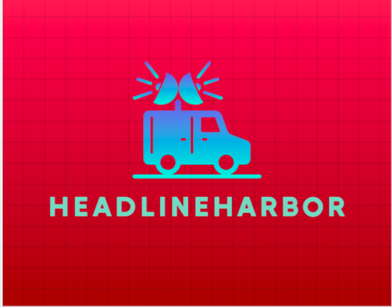

# HeadlineHarbor - Your News Aggregator

HeadlineHarbor is a comprehensive news aggregation platform that offers the latest and most diverse range of news from around the world. Stay informed, stay connected.

## Features

- **Top Headlines**: Instant access to the most important headlines from various categories.
- **Categories**: Explore news across different domains such as Business, Entertainment, Health, Science, Sports, Technology, and more.
- **Infinite Scrolling**: Seamlessly scroll through an endless feed of news articles.
- **Responsive Design**: Enjoy a smooth browsing experience across devices - desktop, tablet, and mobile.

## Technologies Used

- **React.js**: Frontend development framework.
- **React Router**: Navigation within the app.
- **React Infinite Scroll Component**: For infinite scrolling functionality.
- **News API**: Fetching news data from external sources.

## Usage

1. Clone the repository.
2. Install dependencies using `npm install`.
3. Add your News API key in the appropriate location (`.env` or as environment variable).
4. Start the development server with `npm start`.

## Contributing

We welcome contributions! If you find any issues or want to add new features, feel free to submit a pull request.

